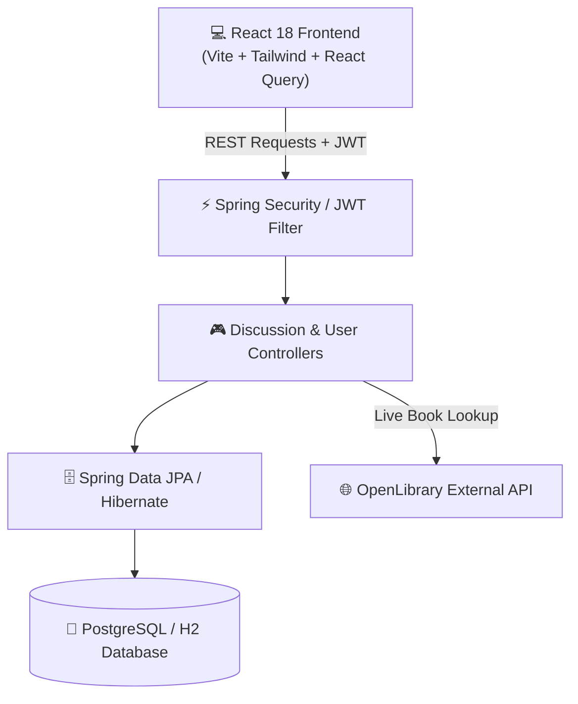

<div align="center">

  # 📚 BookIsh

  ### *A Vintage Literary Parchment Platform for Book Lovers & Community Discourse*

  [](https://spring.io/projects/spring-boot)
  [](https://react.dev/)
  [](https://tailwindcss.com/)
  [](https://www.oracle.com/java/)
  [](LICENSE)

  [Key Features](#-key-features) • [Design System](#-design-system) • [Architecture](#-architecture) • [Getting Started](#-getting-started) • [API Reference](#-api-reference)

</div>

---

## 📖 Overview

**BookIsh** is a full-stack, literary-inspired platform engineered for avid readers, book clubs, and literary enthusiasts. Designed with a custom **"Literary Parchment"** visual aesthetic, BookIsh bridges OpenLibrary's global catalog with deep chapter-by-chapter discussions, threaded community commentary, interactive spoiler masking, and customized reader shelves.

---

## ✨ Key Features

| Feature | Description |
| :--- | :--- |
| 📜 **Literary Parchment UI** | Warm paper surfaces (`#FBF7EE`), ink-black typography (`#1C1917`), and wax-seal crimson accents (`#8C2520`). |
| 📚 **OpenLibrary Integration** | Live search and cataloging across millions of books via OpenLibrary REST API. |
| 💬 **Chapter & Book Discussions** | Dedicated discourse spaces categorized by entire books or specific chapter numbers with full author CRUD control. |
| ⚠️ **Smart Spoiler Protection** | Interactive block blur backdrops and inline `||spoiler||` syntax with smooth click-to-reveal transitions. |
| 🏛️ **Community Forums** | Categorized forum rooms covering General Chat, Recommendations, Author Spotlights, and Genre discussions. |
| 👤 **User Shelves & Profiles** | Personalized reader profiles with tracking shelves (*Want to Read*, *Currently Reading*, *Read*). |
| 🔒 **JWT & OAuth2 Security** | Secure stateless authentication with JWT tokens, password hashing via BCrypt, and Google OAuth2 support. |

---

## 🎨 Design System

BookIsh relies on a strict **75 / 20 / 5** color hierarchy to recreate the tactile feeling of reading a classic hardbound book:

```
├── 📜 Background (75%)   : #FBF7EE (Warm Vintage Parchment)
├── 🖋️ Typography (20%)   : #1C1917 (Deep Ink Black)
└── 🍷 Crimson Accent (5%): #8C2520 (Bookbinders Wax Seal Red)
```

- **Font Family**: Primary body and headings set in classic serif typefaces (`Lora`, `Newsreader`, `Inter`).
- **Interactive Micro-Animations**: Smooth scale transitions, backdrop blurs, and paper-shadow depth effects.

---

## 🏗️ Architecture



---

## 📂 Project Structure

```
BookIsh/
├── 📁 backend/                # Spring Boot REST API
│   ├── src/main/java/com/anshul/bookish/
│   │   ├── config/            # SecurityConfig, JwtAuthFilter, OAuth2 Handlers
│   │   ├── controller/        # DiscussionController, UserController, ForumController
│   │   ├── entity/            # Discussion, Comment, Users, Book, Forum
│   │   ├── repository/        # Spring Data JPA Repositories
│   │   └── service/           # JwtService, MyUserDetailsService
│   └── src/main/resources/    # application.yml
│
└── 📁 frontend/               # React 18 SPA Application
    ├── src/
    │   ├── api/               # Axios API Clients
    │   ├── components/        # SpoilerText, DiscussionCard, CommentThread, Modal
    │   ├── hooks/             # Custom React Query Hooks (useDiscussion)
    │   ├── pages/             # BookDetail, DiscussionThread, ForumDetail, Profile
    │   └── store/             # Zustand Auth & State Store
    └── index.css              # Global Parchment Utilities & Font Declarations
```

---

## 🚀 Getting Started

### Prerequisites

Ensure you have the following installed on your local environment:
- **Java Development Kit (JDK)**: 21 or higher
- **Node.js**: v18.0.0 or higher
- **Package Manager**: `npm` (v9+)

---

### 1. Backend Setup

1. Navigate to the backend directory:
   ```bash
   cd backend
   ```

2. Compile the Spring Boot application using the Maven wrapper:
   ```bash
   ./mvnw clean compile
   ```

3. Run the development server (runs on `http://localhost:8080`):
   ```bash
   ./mvnw spring-boot:run
   ```

> [!NOTE]  
> Default test credentials are pre-configured:
> - **Email**: `bookish@gmail.com`
> - **Password**: `bookish@123`

---

### 2. Frontend Setup

1. Open a new terminal and navigate to the frontend directory:
   ```bash
   cd frontend
   ```

2. Install all frontend dependencies:
   ```bash
   npm install
   ```

3. Start the Vite development server:
   ```bash
   npm run dev
   ```

4. Open your browser and navigate to `http://localhost:5173`.

---

## 🔌 API Reference

### Discussions & Comments

| Method | Endpoint | Description | Auth Required |
| :---: | :--- | :--- | :---: |
| `GET` | `/api/books/{openLibraryId}/discussions` | List all discussions for a book | ❌ |
| `POST` | `/api/books/{openLibraryId}/discussions` | Create a new discussion | ✅ |
| `GET` | `/api/discussions/{id}` | Retrieve a specific discussion thread | ❌ |
| `PUT` | `/api/discussions/{id}` | Update discussion content/spoiler status | ✅ *(Author)* |
| `DELETE` | `/api/discussions/{id}` | Delete discussion and child comments | ✅ *(Author)* |
| `POST` | `/api/discussions/{id}/comments` | Add a comment or reply to thread | ✅ |
| `PUT` | `/api/comments/{id}` | Update comment content/spoiler status | ✅ *(Author)* |
| `DELETE` | `/api/comments/{id}` | Delete a comment | ✅ *(Author)* |

### Authentication & Users

| Method | Endpoint | Description | Auth Required |
| :---: | :--- | :--- | :---: |
| `POST` | `/api/user` | Register a new user account | ❌ |
| `POST` | `/api/auth/login` | Authenticate and obtain JWT token | ❌ |
| `GET` | `/api/user/{id}` | Get user profile details | ❌ |
| `GET` | `/api/user/{id}/discussions` | List discussions created by user | ❌ |

---

## 🤝 Contributing

Contributions, issues, and feature requests are welcome! Feel free to check the [issues page](../../issues).

1. Fork the repository
2. Create your feature branch (`git checkout -b feature/AmazingFeature`)
3. Commit your changes (`git commit -m 'Add some AmazingFeature'`)
4. Push to the branch (`git push origin feature/AmazingFeature`)
5. Open a Pull Request

---

## 📄 License

Distributed under the **MIT License**. See `LICENSE` for more information.

<div align="center">
  <sub>Built with ❤️ for literature and open discussions.</sub>
</div>
